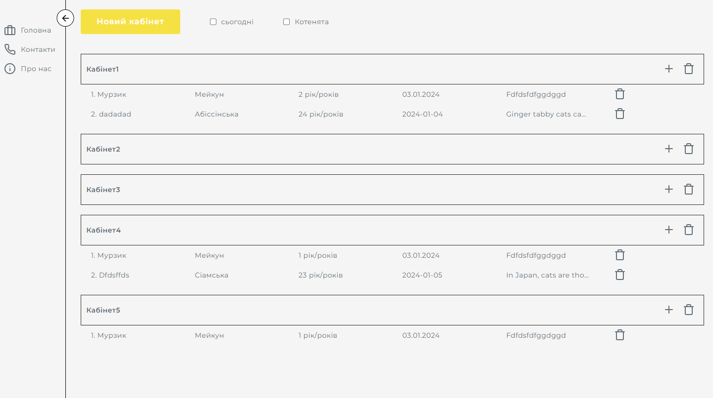
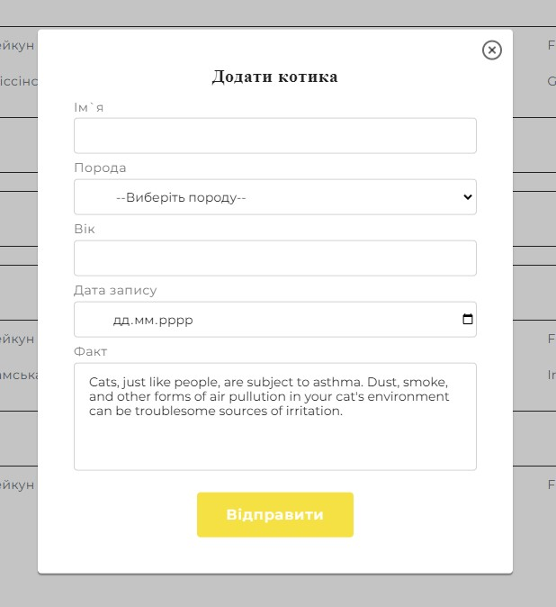
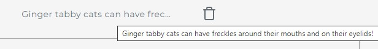
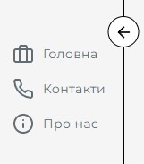
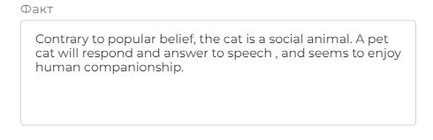

<h1 align="center">Тестове завдання АгроТеп</h1>
<h2 align="center">

## Про цей проєкт

Всі пункти ТЗ виконані.

- Додана можливість додавати котиків через модальне вікно
  - 
- Додана можливість додавати і видаляти як окремий кабінет, так і окремого котика
- Якщо якесь з полів завелике, можна побачити повний текст через підказку
  - 
- Реалізовані всі 3 сторінки
- Можливість згортати бокове меню
  - 
- Факти завантажуються в модальне вікно автоматично (кожен раз новий), але при необхідності є можливість їх змінювати
  - 
- Інформація про кабінети, котиків і стан темної/світлої теми зберігається у локал стореджі, що дозволяє використовувати одну й ту саму інформацію між перезавантаженнями сторінки

## Використані технології і бібліотеки для створення цього проекту:

- Проєкт строрений за допомогою [Vite + React](https://github.com/vitejs/vite)
- [Redux Toolkit](https://redux-toolkit.js.org)
- [Lucide Rect](https://lucide.dev/guide/packages/lucide-react)
- [NanoId](https://www.npmjs.com/package/nanoid)
- [React Redux](https://react-redux.js.org)
- [React Router Dom](https://reactrouter.com/en/main)
- [Redux Persist](https://github.com/rt2zz/redux-persist)
- HTML
- SASS

## Жива сторінка

Жива сторінка доступна за посиланням [https://dtripled.github.io/agrotep_test/](https://dtripled.github.io/agrotep_test/)
